<div align="center">


<h1>Compliance as Code</h1>

<p><strong>The Strategic Control Plane for Continuous Governance, Automated Evidence Orchestration, and Multi-Framework Regulatory Validation</strong></p>

[]()
[]()
[]()
[]()

<br/>

> **"If a control isn't codified, it doesn't exist."** 
> Compliance as Code is an industrial-grade governance platform designed to transform regulatory requirements into executable policies, ensuring continuous audit-readiness across Azure, AWS, GCP, and Kubernetes.

</div>

---

## 🏛️ Executive Summary

**Compliance as Code** is a premium, flagship GRC (Governance, Risk, and Compliance) automation platform designed for CISOs, Internal Auditors, and DevSecOps leaders. Traditional compliance is a "Snapshot in Time"—a painful, manual exercise that is out of date the moment the audit finishes.

This platform provides a **Continuous Controls Monitoring (CCM)** engine that validates infrastructure and application state against codified standards like **ISO 27001**, **NIST CSF**, **PCI DSS**, and **SOC 2**. It automates the collection of **Immutable Evidence**, manages the lifecycle of **Policy Exceptions**, and provides a real-time **Audit Readiness Dashboard** for executive stakeholders.

---

## 💡 Why Compliance as Code Matters

In a high-velocity, multi-cloud environment, manual governance is a bottleneck and a risk.
- **Velocity vs. Governance**: Ensuring that rapid releases don't bypass security controls.
- **Drift Detection**: Identifying when a "Compliant" resource is modified into a "Non-Compliant" state.
- **Audit Fatigue**: Reducing the 1000+ hours spent annually on manual evidence gathering.
- **Regulatory Complexity**: Managing overlapping controls across different regional and industry frameworks.

---

## 🚀 Business Outcomes

### 🎯 Strategic Assurance Impact
- **90% Reduction in Audit Preparation Time**: Moving from manual screenshots to automated evidence vaults.
- **100% Continuous Visibility**: Real-time risk scoring across every cloud resource and Kubernetes cluster.
- **Automated Remediation**: Identifying and fixing "Low-Hanging" compliance failures without human intervention.
- **Institutional Trust**: Providing regulators and customers with verifiable, data-driven proof of security.

---

## 🏗️ Technical Stack

| Layer | Technology | Rationale |
|---|---|---|
| **Policy Engine** | Python / OPA (Rego) | Combining declarative logic with flexible Python-based resource analysis. |
| **Backend** | FastAPI | High-performance asynchronous API for real-time compliance ingestion. |
| **Frontend** | React 18, Vite | Premium executive portal with complex hierarchical data visualizations. |
| **Data Tier** | PostgreSQL | Relational storage for versioned control packs and evidence logs. |
| **Messaging** | Redis | Managing high-frequency scan jobs and asynchronous report generation. |
| **Infrastructure** | Terraform | Multi-cloud IaC for the control plane and regional scan agents. |

---

## 📐 Architecture Storytelling: 45+ Diagrams

### 1. Executive High-Level Architecture
The end-to-end flow of compliance state from cloud resources to board-level scorecards.

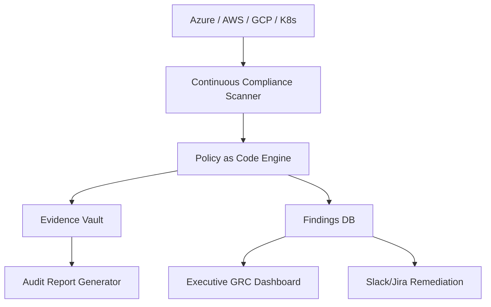

### 2. Detailed Component Topology
The internal service boundaries and secure communication paths for the platform.

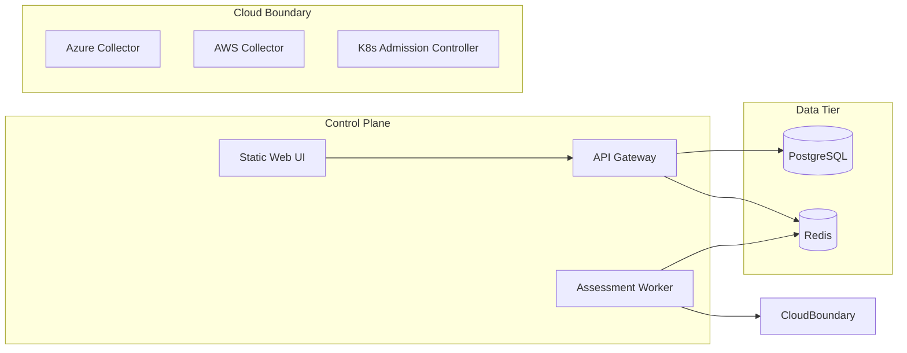

### 3. Frontend to Backend Request Path
Tracing a request to run a real-time ISO 27001 assessment.

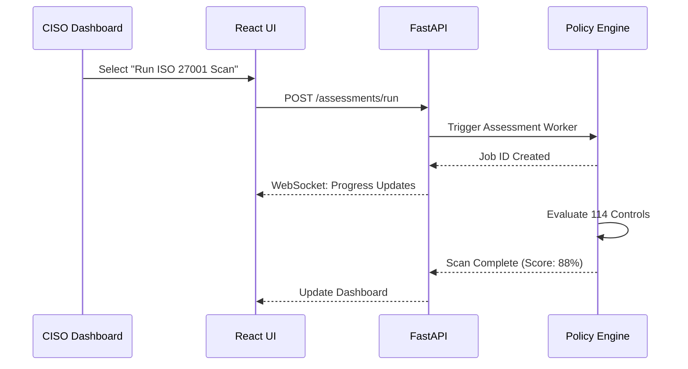

### 4. Multi-Cloud Compliance Control Plane
Orchestrating policy evaluation across provider and regional boundaries.

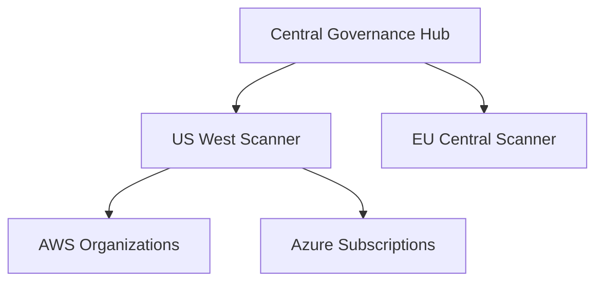

### 5. Assessment Worker Topology
Specialized workers for different layers of the compliance stack.

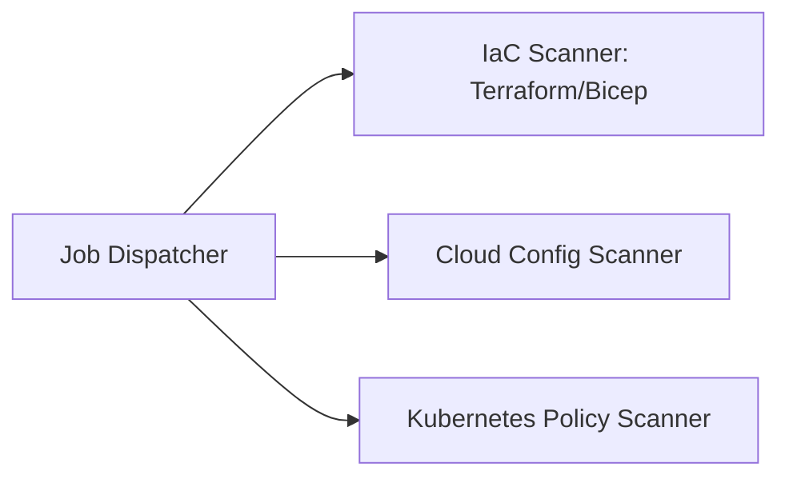

### 6. Regional Deployment Model
Ensuring regional data residency for compliance evidence.

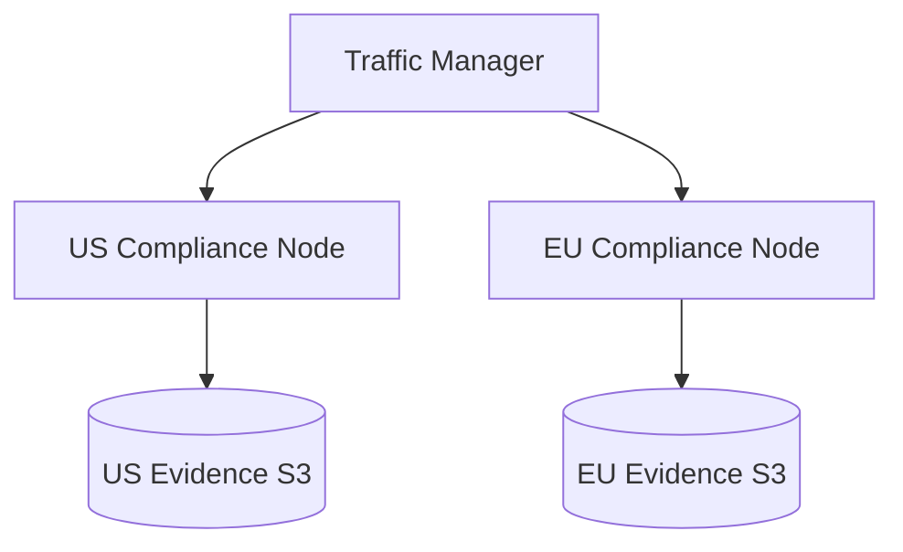

### 7. DR Failover Model
Continuous availability for critical governance operations.

```mermaid
graph LR
    Primary[Active: East US] -->|Sync| Secondary[Standby: West US]
    Secondary -->|Heartbeat| Primary
    Primary --X|Failure| Secondary
```

### 8. API Gateway Architecture
Securing and throttling the GRC intelligence interface.

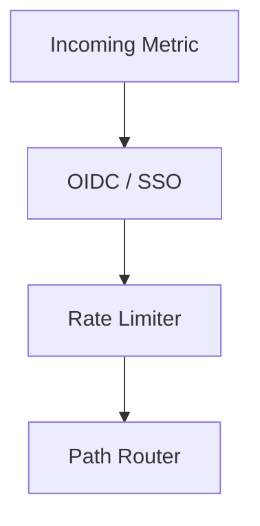

### 9. Queue Worker Architecture
Managing the schedule of high-frequency compliance scans.

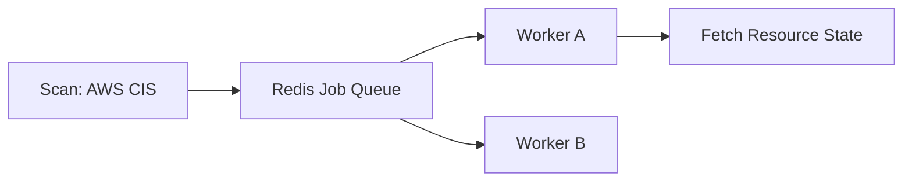

### 10. Dashboard Analytics Flow
How raw resource attributes become executive compliance scores.

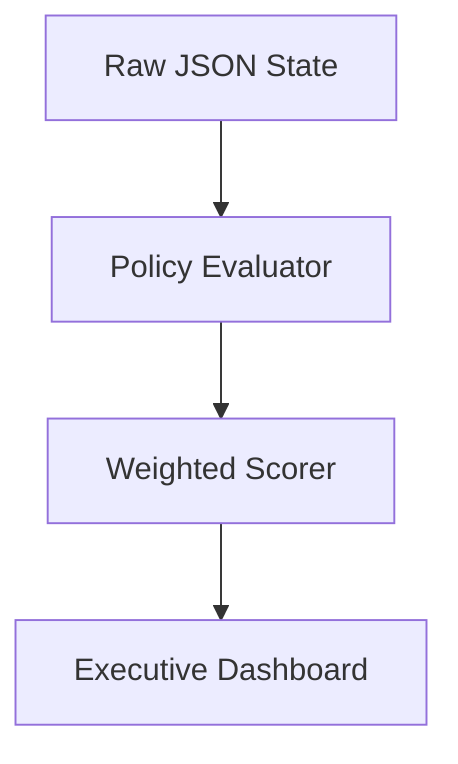

### 11. Policy Evaluation Workflow
The logic flow for a single control validation.

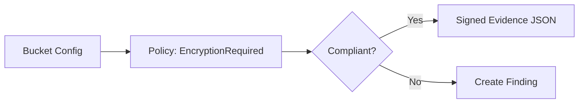

### 12. Continuous Scan Lifecycle
The repeating cycle of automated assurance.

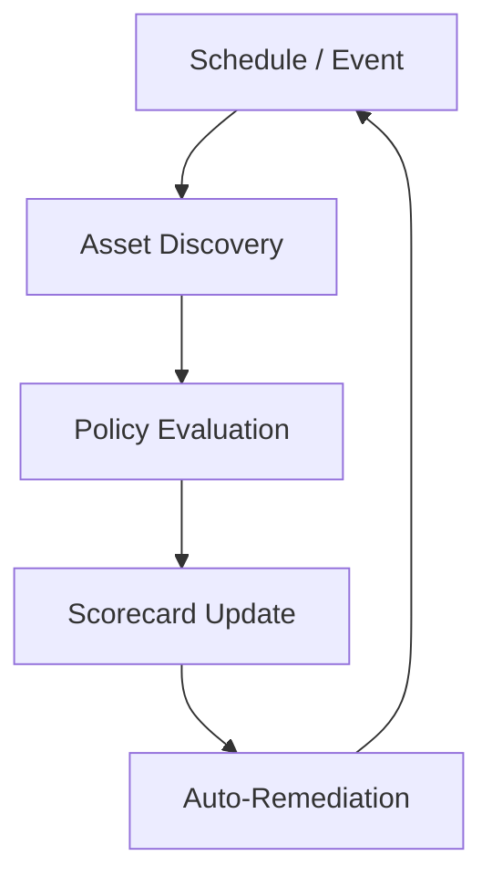

### 13. Evidence Collection Flow
How technical state becomes audit-ready proof.

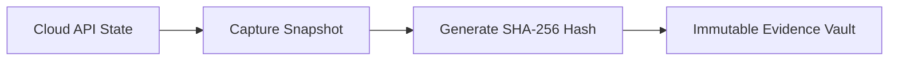

### 14. Control Ownership Model
Assigning responsibility for compliance findings.

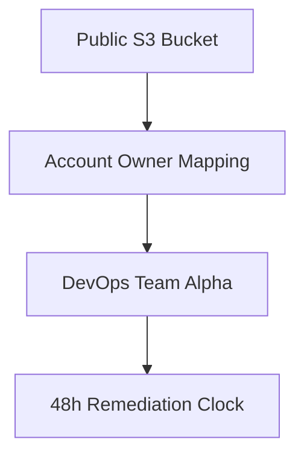

### 15. Exception Request Workflow
Managing the "Golden Rules" with flexibility.

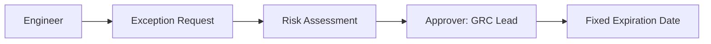

### 16. Waiver Approval Lifecycle
Multi-stage approval for high-risk exceptions.

```mermaid
graph TD
    Req[Req] --> Mgr[Manager]
    Mgr --> Sec[Security Architect]
    Sec --> CISO[CISO (High Risk Only)]
```

### 17. Remediation Tracking Flow
Closing the loop on non-compliance.

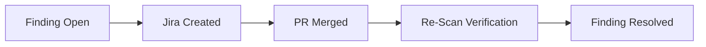

### 18. Regulatory Mapping Model
The "One Control, Many Frameworks" logic.

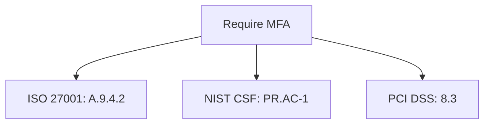

### 19. Framework Crosswalk Flow
Normalizing controls across diverse standards.

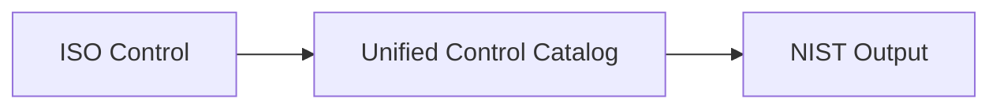

### 20. Audit Pack Generation Lifecycle
Automated creation of the "Compliance Binder".

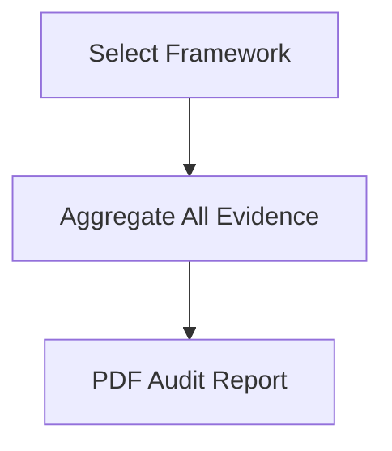

### 21. ISO 27001 Control Mapping
The structure of the ISO 27001 control set.

```mermaid
graph TD
    ISO[ISO 27001] --> A5[A.5 Information Security Policies]
    ISO --> A9[A.9 Access Control]
    A9 --> A942[MFA Requirement]
```

### 22. NIST CSF Maturity Model
Visualizing the Tier 1-4 maturity levels.

```mermaid
graph LR
    T1[Partial] --> T2[Risk Informed]
    T2 --> T3[Repeatable]
    T3 --> T4[Adaptive]
```

### 23. PCI DSS Evidence Workflow
Gathering proof for payment card security.

```mermaid
graph LR
    Scan[Vulnerability Scan] --> Proof[Signed Scan Report]
    Proof --> Vault[PCI Evidence Vault]
```

### 24. SOC 2 Readiness Flow
Preparing for the CPA audit.

```mermaid
graph TD
    Criteria[Trust Services Criteria] --> Evidence[Continuous Evidence]
    Evidence --> Readiness[Internal Audit Gap Analysis]
```

### 25. CIS Benchmark Alignment
Standardized configuration hardening.

```mermaid
graph LR
    Bench[CIS Azure Benchmark] --> Rule[Rule 1.1: Ensure MFA]
    Rule --> Pass[Status: Pass]
```

### 26. GDPR Data Governance Model
Tracking PII and residency requirements.

```mermaid
graph TD
    Data[Customer PII] --> Region[Region: EU West]
    Region --> Policy[Data Residency Check]
```

### 27. HIPAA Control Mapping
Health data protection controls.

```mermaid
graph LR
    HIPAA[HIPAA Technical Safeguards] --> Enc[Audit Controls: 164.312]
```

### 28. SOX Segregation Workflow
Financial reporting controls.

```mermaid
graph TD
    Action[Deploy to Prod] --> Check[Segregation of Duties]
```

### 29. Third-party Assurance Lifecycle
Managing vendor compliance.

```mermaid
graph LR
    Vendor[SaaS Provider] --> Assessment[Questionnaire + Scan]
```

### 30. Executive Risk Score Model
The top-level posture metric.

```mermaid
graph TD
    Critical[Critical: 50%] --> Global[Global Posture Score]
    High[High: 30%] --> Global
    Med[Medium: 20%] --> Global
```

### 31. OIDC / SSO Auth Flow
Securing the GRC portal.

```mermaid
sequenceDiagram
    User->>Portal: Login
    Portal->>IDP: Redirect
    IDP-->>User: Token
```

### 32. RBAC Model
Granular governance permissions.

```mermaid
graph TD
    Admin[Governance Admin] --> Full
    Auditor[External Auditor] --> ReadEvidence
```

### 33. Secrets Management Flow
Securing scan credentials.

```mermaid
graph LR
    Worker[Scanner] --> Vault[Vault]
    Vault -->|Provide| Key[ReadOnly API Key]
```

### 34. Audit Logging Architecture
Ensuring every change is recorded.

```mermaid
graph TD
    Action[Change Policy] --> Log[Immutable Audit Event]
```

### 35. Network Boundary Model
Isolating the governance control plane.

```mermaid
graph LR
    Public[Public Net] --> WAF[WAF]
    WAF --> Private[Private GRC VNet]
```

### 36. CI/CD Policy Gate Workflow
The "Shift Left" compliance check.

```mermaid
graph LR
    PR[Pull Request] --> IaC_Scan[IaC Policy Scan]
    IaC_Scan -->|Pass| Merge[Merge Approved]
    IaC_Scan -->|Fail| Block[Merge Blocked]
```

### 37. IaC Scan Lifecycle
Validating Terraform before deployment.

```mermaid
graph TD
    TF[Terraform Plan] --> PlanJSON[JSON Plan]
    PlanJSON --> Rego[Rego Policy Check]
```

### 38. Container Compliance Flow
Securing the image pipeline.

```mermaid
graph LR
    Build[Docker Build] --> Scan[Vulnerability Scan]
    Scan --> Policy[Base Image Policy]
```

### 39. Kubernetes Policy Enforcement
Admission control with Gatekeeper/Kyverno.

```mermaid
graph TD
    Req[Kubectl Apply] --> Admission[Admission Webhook]
    Admission --> Check{Compliant?}
```

### 40. Drift Detection Workflow
Detecting manual changes that break compliance.

```mermaid
graph LR
    TF[TF State] --> Compare[Actual State]
    Compare --> Drift[Drift Detected]
```

### 41. Metrics Pipeline
Monitoring the assurance engine.

```mermaid
graph LR
    App[GRC App] --> Prometheus[Prometheus]
```

### 42. Logging Architecture
Centralized logs for GRC forensics.

```mermaid
graph TD
    Logs[Application Logs] --> ELK[ELK Stack]
```

### 43. Tracing Model
Tracing cross-cloud assessments.

```mermaid
sequenceDiagram
    API->>Worker: Start Scan
    Worker->>Azure: Get Config
```

### 44. SLA Monitoring Flow
Guaranteeing scan frequency.

```mermaid
graph LR
    Probe[Health Check] --> Dashboard[SLA Status]
```

### 45. Release Pipeline Workflow
Automated delivery of the GRC platform.

```mermaid
graph LR
    Git[Code Push] --> GHA[GitHub Actions]
    GHA --> EKS[EKS Deployment]
```

---

## 🔬 Policy as Code Methodology

### 1. The Declarative Standard
We utilize **Rego (OPA)** and **YAML** to define what "Compliant" looks like. Policies are versioned in Git, peer-reviewed like application code, and automatically tested. This eliminates the ambiguity of "Checklists" and replaces them with executable truth.

### 2. Continuous Controls Monitoring (CCM)
Traditional auditing is a manual sampling of 10-20 items. CCM validates **100% of your resources, 100% of the time**. If a database is created without encryption, the system detects it in minutes, not months.

---

## 🚦 Getting Started

### 1. Prerequisites
- **Terraform** (v1.5+).
- **Docker Desktop**.
- **Python 3.11+**.

### 2. Local Setup
```bash
# Clone the repository
git clone https://github.com/Devopstrio/compliance-as-code.git
cd compliance-as-code

# Setup environment
cp .env.example .env

# Start services
docker-compose up --build
```
Access the GRC portal at `http://localhost:3000`.

---

## 🛡️ Governance & Security
- **Evidence Immutability**: All evidence is stored in WORM (Write-Once-Read-Many) buckets with digital signatures.
- **Audit Trails**: Every user action within the portal is logged to a secure, centralized audit log.
- **Least Privilege**: Regional scan agents use read-only permissions and are restricted to specific VPCs/VNets.

---
<sub>&copy; 2026 Devopstrio &mdash; Engineering the Future of Continuous Assurance.</sub>
