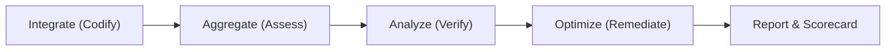
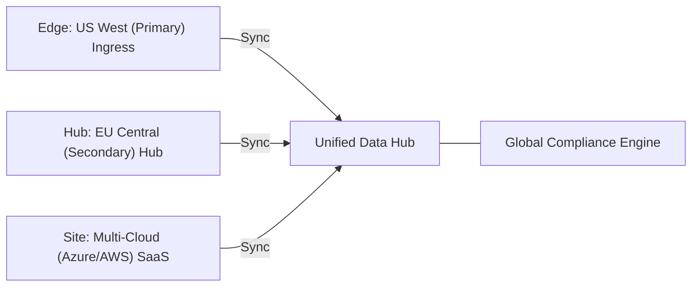
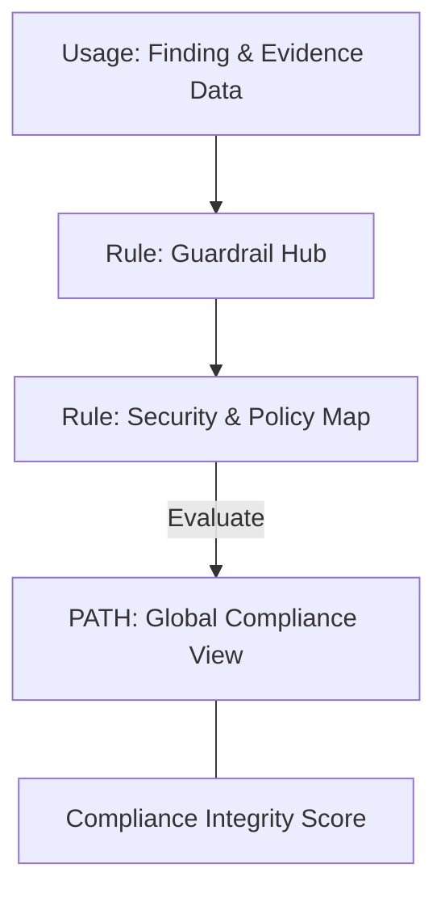
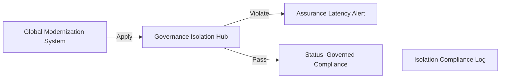
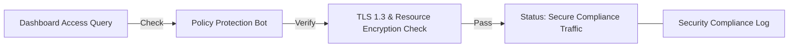
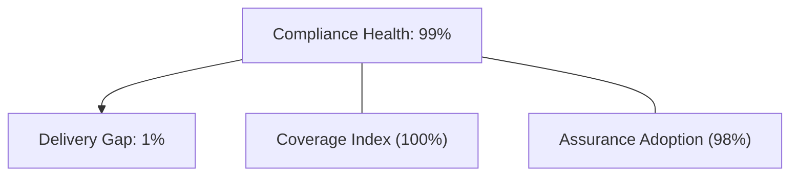
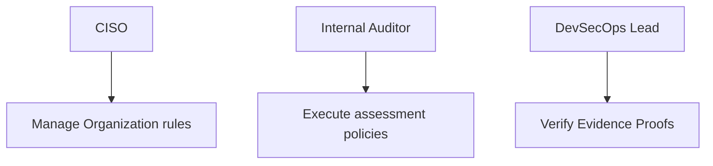
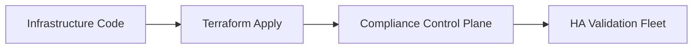
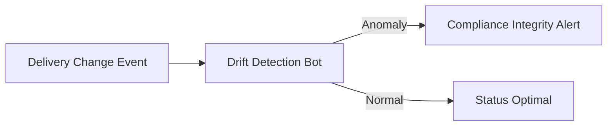
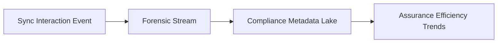

<div align="center">


<h1>Compliance as Code</h1>

<p><strong>The Institutional-Grade Platform for Standardized Compliance Foundations, Policy Governance, and Multi-Cloud Assurance Ecosystems.</strong></p>

[]()
[]()
[]()

<br/>

> **"Industrializing compliance to automate policy foundations."** 
> **Compliance as Code** is an enterprise-grade platform designed to provide a secure, measurable, and highly automated foundation for global compliance operations. It orchestrates the complex lifecycle of continuous assurance—from codified policy evaluation and multi-framework validation to high-throughput evidence orchestration and unified compliance auditing.

</div>

---

## 🏛️ Executive Summary

Manual auditing and static compliance checklists are strategic operational liabilities; lack of a standardized compliance-as-code framework is a primary barrier to organizational engineering maturity. Organizations fail to maintain continuous assurance not because of a lack of policies, but because of fragmented evaluation standards, lack of automated evidence collection, and an inability to orchestrate policy planes with operational precision.

This platform provides the **Policy Intelligence Plane**. It implements a complete **Compliance-As-Code Framework**, enabling CISOs and Internal Auditors to manage global compliance foundations as first-class citizens. By automating the identification of postural regressions through real-time telemetry analysis and orchestrating the provisioning of secure performance-driven compliance policies, we ensure that every organizational resource—from core database clusters to edge microservices—is compliant by default, audited for history, and strictly aligned with institutional compliance frameworks.

---

## 📐 Architecture Storytelling: Principal Reference Models

### 1. Principal Architecture: Global Compliance-as-Code & Policy Intelligence Plane
This diagram illustrates the end-to-end flow from compliance telemetry ingestion and multi-cloud orchestration to policy enforcement, performance validation, and institutional compliance auditing.


```mermaid
graph LR
    %% Subgraph Definitions
    subgraph ComplianceIngress["Technical & Policy Ingress"]
        direction TB
        Cloud_State["Resource Configs (Azure/AWS/GCP)"]
        Codified_Rules["Rego / YAML Policy Definitions"]
        Regulatory_Frameworks["ISO / NIST / PCI / SOC2"]
    end

    subgraph IntelligenceEngine["Policy Intelligence Hub"]
        direction TB
        API["FastAPI Compliance Gateway"]
        PolicyOrchestrator["Global CCM & Evidence Hub"]
        Governance_Hub["Compliance & Guardrail Hub"]
        AIOps_Validator["Drift & Policy Analysis Hub"]
    end

    subgraph OperationsPlane["Distributed Compliance Ecosystem"]
        direction TB
        ManagedAssuranceNodes["Managed Standardized Scanners"]
        ActiveRunbooks["Managed Automated Remediation Runbooks"]
        EvidenceSinks["Managed Infrastructure Delivery Hubs"]
    end

    subgraph OperationsHub["Institutional Data Hub"]
        direction TB
        Scorecard["Compliance Maturity Scorecard"]
        Analytics["Assurance Flow & Remediation Velocity Stats"]
        Audit["Forensic Compliance Metadata Lake"]
    end

    subgraph DevOps["Compliance-as-Code Framework"]
        direction TB
        TF["Terraform Compliance Modules"]
        DriftBot["Productivity & Config Drift Validator"]
        ChatOps["Measurement Operations Hub"]
    end

    %% Flow Arrows
    ComplianceIngress -->|1. Submit Telemetry| API
    API -->|2. Orchestrate Compliance| PolicyOrchestrator
    PolicyOrchestrator -->|3. Apply Privacy Guard| Governance_Hub
    Governance_Hub -->|4. Assess Drift| AIOps_Validator
    
    AIOps_Validator -->|5. Execute Assessment| OperationsPlane
    OperationsPlane -->|6. Notify Status| ChatOps
    API -->|7. Visualize Health| Scorecard
    
    Scorecard -->|8. Track Maturity| Analytics
    Scorecard -->|9. Record Performance| Audit
    
    TF -->|10. Provision Backbone| IntelligenceEngine
    DriftBot -->|11. Inject Friction Risk| PolicyOrchestrator
    Audit -->|12. Improve Operations| ManagedAssuranceNodes

    %% Styling
    classDef ingress fill:#f5f5f5,stroke:#616161,stroke-width:2px;
    classDef intel fill:#e8eaf6,stroke:#1a237e,stroke-width:2px;
    classDef operations fill:#e1f5fe,stroke:#01579b,stroke-width:2px;
    classDef ops fill:#ede7f6,stroke:#311b92,stroke-width:2px;
    classDef devops fill:#e8f5e9,stroke:#1b5e20,stroke-width:2px;

    class ComplianceIngress ingress;
    class IntelligenceEngine intel;
    class OperationsPlane operations;
    class OperationsHub ops;
    class DevOps devops;
```

### 2. The Compliance Lifecycle Flow
The continuous path of a compliance-as-code platform from initial integration (codify) and aggregation (assess) to active analysis (verify), optimization (remediate), and institutional forensic auditing (scorecard).


```mermaid
graph LR
    Integrate["Integrate (Codify)"] --> Aggregate["Aggregate (Assess)"]
    Aggregate --> Analyze["Analyze (Verify)"]
    Analyze --> Optimize["Optimize (Remediate)"]
    Optimize --> Report["Report & Scorecard"]
```

### 3. Distributed Policy Topology
Strategically orchestrating standardized compliance across global regions, diverse cloud architectures, and multi-cloud targets, providing a unified institutional view of global compliance health and operational readiness.


```mermaid
graph LR
    RegionA["Edge: US West (Primary) Ingress"] -->|Sync| Hub["Unified Data Hub"]
    BU["Hub: EU Central (Secondary) Hub"] -->|Sync| Hub
    Cloud["Site: Multi-Cloud (Azure/AWS) SaaS"] -->|Sync| Hub
    Hub --- Logic["Global Compliance Engine"]
```

### 4. Policy Hub & High-Trust Data Plane Protection Flow
Executing complex logic for securing the bridge between auditors and technical teams, ensuring every organizational identity is verified, evidence-level privacy is maintained, and every policy access is according to institutional standards.


```mermaid
graph TD
    ComplianceData["Usage: Finding & Evidence Data"] --> Bridge["Rule: Guardrail Hub"]
    Bridge --> PolicyMap["Rule: Security & Policy Map"]
    PolicyMap -->|Evaluate| Context["PATH: Global Compliance View"]
    Context --- Estimate["Compliance Integrity Score"]
```

### 5. Multi-Cloud Policy Federation & Governance Flow
Automatically managing unified compliance standards across global regions and diverse cloud tenants, ensuring institutional data residency and privacy boundaries by default.


```mermaid
graph LR
    Org["Global Modernization System"] -->|Apply| Guard["Governance Isolation Hub"]
    Guard -->|Violate| Alert["Assurance Latency Alert"]
    Guard -->|Pass| Verify["Status: Governed Compliance"]
    Verify --- Audit["Isolation Compliance Log"]
```

### 6. Encryption & Perimeter Protection Flow (Policy Standard)
Managing the lifecycle of a compliance request, automatically enforcing institutional TLS 1.3 and resource encryption standards as required by security policy, ensuring zero-latency security confidence.


```mermaid
graph LR
    ComplianceReq["Dashboard Access Query"] -->|Check| Gatekeeper["Policy Protection Bot"]
    Gatekeeper -->|Verify| TLS["TLS 1.3 & Resource Encryption Check"]
    TLS -->|Pass| Admit["Status: Secure Compliance Traffic"]
    Admit --- Audit["Security Compliance Log"]
```

### 7. Institutional Policy Maturity Scorecard
Grading organizational performance based on key indicators: Policy Coverage Index, Evidence Fidelity Index, and Assurance Adoption Scores.


```mermaid
graph TD
    Post["Compliance Health: 99%"] --> Risk["Delivery Gap: 1%"]
    Post --- C1["Coverage Index (100%)"]
    Post --- C2["Assurance Adoption (98%)"]
```

### 8. Identity & RBAC for Policy Governance
Managing fine-grained access to compliance hubs, provisioning workers, and audit logs between CISOs, Auditors, and DevSecOps Leads.


```mermaid
graph TD
    CISO["CISO"] --> Hub["Manage Organization rules"]
    Auditor["Internal Auditor"] --> Exec["Execute assessment policies"]
    Lead["DevSecOps Lead"] --> Audit["Verify Evidence Proofs"]
```

### 9. IaC Deployment: Compliance-as-Code Framework
Using modular Terraform to deploy and manage the versioned distribution of the compliance tracking hubs, scanner protection workers, and forensic metadata lakes.


```mermaid
graph LR
    HCL["Infrastructure Code"] --> TF["Terraform Apply"]
    TF --> Engine["Compliance Control Plane"]
    Engine --> Clusters["HA Validation Fleet"]
```

### 10. AIOps Policy Drift & Risk Validation Flow
Using advanced analytics to identify sudden surges in non-compliance findings, unauthorized policy changes, suspicious configuration drifts, or unusual delivery pattern changes that could result in institutional risk or audit failure.


```mermaid
graph LR
    Drift["Delivery Change Event"] --> Analyzer["Drift Detection Bot"]
    Analyzer -->|Anomaly| Alert["Compliance Integrity Alert"]
    Analyzer -->|Normal| Pass["Status Optimal"]
```

### 11. Metadata Lake for Forensic Policy Audit
Storing long-term records of every compliance integration event (metadata), every evidence collected, and every version history for institutional record-keeping, compliance auditing, and post-provisioning forensics.


```mermaid
graph LR
    Provision["Sync Interaction Event"] --> Stream["Forensic Stream"]
    Stream --> Lake["Compliance Metadata Lake"]
    Lake --> Trends["Assurance Efficiency Trends"]
```

---

## 🏛️ Core Governance Pillars

1.  **Unified Foundation Coordination**: Maximizing resilience by centralizing all compliance measurement through a single institutional plane.
2.  **Automated Evidence Provisioning**: Eliminating "manual audit" scenarios through proactive orchestration and pattern verification.
3.  **Sequential Policy Intelligence**: Ensuring zero-interruption operations through dependency-aware policy-driven data engineering.
4.  **Zero-Trust Identity Protection**: Automatically enforcing identity-based access, data-at-rest encryption, and policy evaluation across all assurance tiers.
5.  **Autonomous Operations Logic**: Guaranteeing reliability through automated industry-specific effectiveness monitoring runbooks.
6.  **Full Compliance Auditability**: Immutable recording of every policy change and compliance provision for institutional forensics.

---

## 🛠️ Technical Stack & Implementation

### Compliance Engine & APIs
*   **Framework**: Python 3.11+ / FastAPI.
*   **Performance Engine**: Custom Python-based logic for multi-framework mapping and DORA-style assurance metrics.
*   **Integrations**: Native connectors for OPA (Rego), Cloud APIs, and GRC toolchains.
*   **Persistence**: PostgreSQL (Compliance Ledger) and Redis (Live Assessment State).
*   **Auth Orchestrator**: Federated OIDC/SAML for least-privilege compliance management access.

### Governance Dashboard (UI)
*   **Framework**: React 18 / Vite.
*   **Theme**: Dark, Slate, Indigo (Modern high-fidelity productivity aesthetic).
*   **Visualization**: D3.js for delivery topologies and Recharts for remediation velocity analytics.

### Infrastructure & DevOps
*   **Runtime**: AWS EKS or Azure Kubernetes Service (AKS) for management plane.
*   **Measurement Hub**: Managed event sourcing for immutable productivity timeline reconstruction.
*   **IaC**: Modular Terraform for deploying the compliance landing zone and validation fleet.

---

## 🏗️ IaC Mapping (Module Structure)

| Module | Purpose | Real Services |
| :--- | :--- | :--- |
| **`infrastructure/compliance_hub`** | Central management plane | EKS, PostgreSQL, Redis |
| **`infrastructure/enforcers`** | Distributed assurance provisioners | Azure, AWS, GCP APIs |
| **`infrastructure/policy_pipes`** | Data Ingestion Hubs | Webhooks, Lambda |
| **`infrastructure/auditing`** | Forensic modernization sinks | S3, Athena, Quicksight |

---

## 🚀 Deployment Guide

### Local Principal Environment
```bash
# Clone the Compliance as Code repository
git clone https://github.com/devopstrio/compliance-as-code.git
cd compliance-as-code

# Configure environment
cp .env.example .env

# Launch the Compliance stack
make init

# Trigger a mock compliance update and automated guardrail validation simulation
make simulate-compliance
```

Access the Management Portal at `http://localhost:3000`.

---

## 📜 License
Distributed under the MIT License. See `LICENSE` for more information.

---
<div align="center">
  <p>© 2026 Devopstrio. All rights reserved.</p>
</div>
